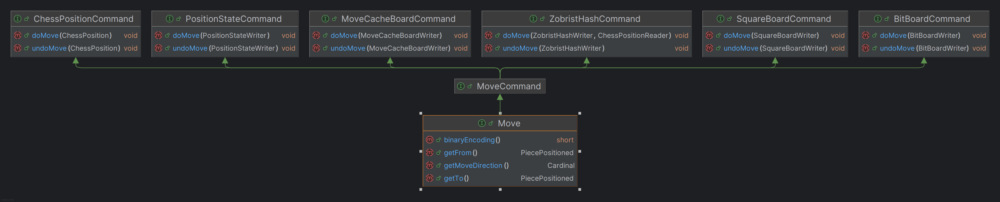

# Collaboration Between Classes in Terms of the Command Design Pattern

The collaboration between these classes in terms of the **Command Design Pattern** demonstrates a well-structured example of encapsulating chess-related operations into discrete commands that can be executed and undone. Here's a description of this collaboration:

---

## Command Design Pattern Overview in this Context

The **Command Design Pattern** is generally used to encapsulate all the details needed to perform an action, including the operation itself, the parameters, and the receiver of the action. It provides a way to decouple the execution of a command from the object that requests the operation. In the chess-related implementation, each command represents a specific aspect of a move and operates on the corresponding part of the chess game's state.

---

## Key Classes and Their Roles

### 1. `Move` (Concrete Command)
- Implements `MoveCommand`, representing a concrete command that encapsulates the details of a chess move.
- Provides specific methods for chess move operations, such as:
    - Identifying the source (`getFrom`) and destination (`getTo`) squares.
    - Determining move directions.
- Through `MoveCommand`, it wraps operations related to:
    - Updating the chess position (`ChessPositionCommand`).
    - Manipulating the chessboard square representation (`SquareBoardCommand`).
    - Updating move caches (`MoveCacheBoardCommand`).
    - Low-level bitboard operations (`BitBoardCommand`).
    - Updating the game's position state (`PositionStateCommand`).
    - Handling Zobrist hashing for position history uniqueness (`ZobristHashCommand`).

### 2. `MoveCommand` (Composite Command Interface)
- Serves as the composite interface, combining the functionality of multiple command interfaces:
    - `ChessPositionCommand`
    - `SquareBoardCommand`
    - `MoveCacheBoardCommand`
    - `BitBoardCommand`
    - `PositionStateCommand`
    - `ZobristHashCommand`
- The various concrete commands implementing these underlying interfaces encapsulate the details required for specific aspects of a chess move.

### 3. Individual Command Interfaces and Their Responsibilities
- **`ChessPositionCommand`**:
    - Focuses on altering and restoring the overall chess position (`doMove` and `undoMove`).
- **`SquareBoardCommand`**:
    - Handles lower-level operations on the chessboard representation as it relates to individual squares (`doMove` and `undoMove`).
- **`MoveCacheBoardCommand`**:
    - Operates on a cache or intermediary data structure that may store optimizations related to moves (`doMove` and `undoMove`).
- **`BitBoardCommand`**:
    - Handles efficient bit-level representations of the game board commonly used in chess engines for performance (`doMove` and `undoMove`).
- **`PositionStateCommand`**:
    - Tracks and updates the state of the board's position, such as keeping track of castling rights, en passant, and other positional attributes (`doMove` and `undoMove`).
- **`ZobristHashCommand`**:
    - Manages unique hashing using Zobrist hashing to identify board states for tasks such as detecting repetitions or transpositions during searches (`doMove` and `undoMove`).

---

## Collaboration Between Classes

### 1. `Move` Encapsulates High-Level Commands
- The `Move` class acts as a concrete implementation of `MoveCommand` and orchestrates low-level commands via delegation to interfaces such as `ChessPositionCommand`, `SquareBoardCommand`, `BitBoardCommand`, etc.
- This layering enables flexibility, as each implementation (like `ZobristHashCommand`) can handle its specific concerns without being tightly coupled to the others.

### 2. Interfaces Decouple Behavior from Implementation
- The individual command interfaces ensure that specific responsibilities (like hash updates, position state changes, or board square updates) are separated, allowing for independent modification and testing.

### 3. Execution and Undo Capability
- Each command interface (`doMove` and `undoMove`) provides a consistent mechanism to execute a move operation and revert it. This is crucial for backtracking during tasks such as move search (e.g., minimax and alpha-beta pruning).

### 4. Scalability of the Command Pattern
- New commands can be added easily by augmenting the `MoveCommand` composite interface or implementing additional behavior within the existing system of commands, thanks to the modular design.

---

## Summary of Benefits

- **Encapsulation**: Each aspect of a chess move is encapsulated in separate command interfaces, reducing the complexity of individual classes.
- **Undoability**: The `doMove` and `undoMove` methods ensure that every chess move can be cleanly executed and reverted, which is essential for a chess engine's core operations.
- **Flexibility**: The decoupling between `Move` and its underlying commands provides flexibility to modify or extend functionality without affecting the high-level logic.
- **Reusability**: Individual commands (e.g., `ZobristHashCommand`, `BitBoardCommand`) are reusable in other areas of the chess engine where similar responsibilities are required.

---

This implementation showcases a clean application of the **Command Design Pattern** for modeling chess move operations in a flexible and scalable way.
