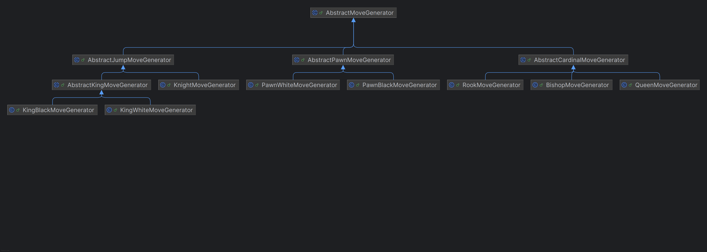

# Strategy Pattern in the Move Generation System

The Strategy design pattern is used to define a family of algorithms, encapsulate each one, and make them interchangeable. In the provided code, the **`MoveGenerator`** system for a chess engine represents a clear example of the **Strategy pattern**. Below is the detailed explanation:

---

## **Context:**
The `MoveGeneratorImp` class serves as a **context** that uses different concrete implementations of move generation strategies for various chess pieces. This context delegates the logic of move generation to specific strategy implementations, depending on the piece type.

---

## **Strategy Interface:**
The interface `MoveGeneratorByPiecePositioned` acts as the **Strategy Interface**. This is the contract that all concrete move generation strategies implement. It defines the method:

```java
MoveGeneratorResult generatePseudoMoves(PiecePositioned origen);
```

This method is the primary operation used to generate pseudo-legal moves for a given piece at a specific position.

---

## **Concrete Strategies:**
The system has multiple **Concrete Strategy Classes**, each encapsulating the logic for generating pseudo-legal moves for a specific type of chess piece or specific scenarios. Examples include:

### **1. Pawn Move Generators:**
- `PawnWhiteMoveGenerator` and `PawnBlackMoveGenerator`
    - Logic for pawn-specific movement such as forward moves, attacks, en passant, and promotions based on the pawn's color.
    - Extend from `AbstractPawnMoveGenerator`, which provides a template-based structure for pawn move generation.

### **2. Cardinal Move Generators:**
- `RookMoveGenerator`, `BishopMoveGenerator`, and `QueenMoveGenerator`
    - Implement move generation for pieces with cardinal movement rules (linear and diagonal movements).
    - Extend `AbstractCardinalMoveGenerator`.

### **3. Knight Move Generator:**
- `KnightMoveGenerator`
    - Handles "jump-based" moves specific to knights.
    - Extends `AbstractJumpMoveGenerator`, which focuses on non-contiguous movement.

### **4. King Move Generators:**
- `KingWhiteMoveGenerator` and `KingBlackMoveGenerator`
    - Logic for king-specific movements, including castling.
    - Extend `AbstractKingMoveGenerator`, which encapsulates castling logic and standard king moves.

---

## **`MoveGeneratorImp` as the Context:**
The `MoveGeneratorImp` class acts as the **Context** in the Strategy pattern. It determines which strategy to use based on the type of chess piece.

### **1. Delegation of Move Generation:**
The `MoveGeneratorImp` delegates the task of generating moves to the appropriate `MoveGeneratorByPiecePositioned` implementation via a **strategy selection mechanism**, as shown below:

```java
private MoveGeneratorByPiecePositioned selectMoveGeneratorStrategy(Piece piece) {
    return switch (piece) {
        case PAWN_WHITE -> this.pawnWhiteMoveGenerator;
        case PAWN_BLACK -> this.pawnBlackMoveGenerator;
        case ROOK_WHITE -> this.rookWhiteMoveGenerator;
        case ROOK_BLACK -> this.rookBlackMoveGenerator;
        case KNIGHT_WHITE -> this.knightWhiteMoveGenerator;
        case KNIGHT_BLACK -> this.knightBlackMoveGenerator;
        case BISHOP_WHITE -> this.bishopWhiteMoveGenerator;
        case BISHOP_BLACK -> this.bishopBlackMoveGenerator;
        case QUEEN_WHITE -> this.queenWhiteMoveGenerator;
        case QUEEN_BLACK -> this.queenBlackMoveGenerator;
        case KING_WHITE -> this.kingWhiteMoveGenerator;
        case KING_BLACK -> this.kingBlackMoveGenerator;
        default -> throw new RuntimeException("Generator not found");
    };
}
```

### **2. Setup of Dependencies:**
The `MoveGeneratorImp` configures dependencies for the individual piece-specific move generators:

```java
private void setupMoveGenerators() {
    this.pawnWhiteMoveGenerator.setMoveFactory(moveFactoryWhite);
    this.pawnBlackMoveGenerator.setMoveFactory(moveFactoryBlack);
    ...
}
```

### **3. Execution of Strategies:**
When generating moves, the `MoveGeneratorImp` uses the selected strategy:

```java
@Override
public MoveGeneratorResult generatePseudoMoves(PiecePositioned origen) {
    MoveGeneratorByPiecePositioned strategy = selectMoveGeneratorStrategy(origen.getPiece());
    return strategy.generatePseudoMoves(origen);
}
```

---

## **Abstract Classes as Template Helpers**

Some abstract classes help facilitate shared behavior among strategies. These abstract classes follow the **Template Design Pattern** within the Strategy system, enabling reuse. Examples include:

### **1. `AbstractCardinalMoveGenerator`:**
- Encapsulates shared logic for move generation in cardinal directions.
- Subclasses (`RookMoveGenerator`, `BishopMoveGenerator`, `QueenMoveGenerator`) implement `createSimpleMove` and `createCaptureMove`.

### **2. `AbstractPawnMoveGenerator`:**
- Handles common behavior for pawn-specific movements like forward, attack, and promotion rules.
- Subclasses (`PawnWhiteMoveGenerator`, `PawnBlackMoveGenerator`) define movement specifics like direction and promotion logic.

### **3. `AbstractJumpMoveGenerator`:**
- Facilitates generation of non-contiguous jump moves for pieces like knights and kings.

### **4. `AbstractKingMoveGenerator`:**
- Encapsulates king movement logic, including validation for castling moves.




---

## **Benefits of the Strategy Pattern in this Context**

### **1. Encapsulation of Move Logic**
Each piece-specific move generation logic is encapsulated in its own class, making the code cleaner, modular, and reusable.

### **2. Code Reusability**
Abstract classes like `AbstractMoveGenerator` enable shared behavior, reducing code duplication. New move generators can be added by simply implementing `MoveGeneratorByPiecePositioned`.

### **3. Flexibility**
The specific strategy selected for move generation can easily be updated or replaced dynamically by the `MoveGeneratorImp`.

### **4. Adheres to Open/Closed Principle**
The design adheres to the **Open/Closed Principle**: the system is open to adding new behaviors (e.g., new piece movement logic) without modifying existing code.

---

## **Summary of Collaboration**

1. **`MoveGeneratorImp` (Context):**
    - Sets up and manages all move generator strategies.
    - Delegates the move generation task to the appropriate strategy based on the type of chess piece.

2. **Strategy Classes:**
    - Implement move generation logic for specific pieces or behaviors (pawn moves, rook moves, en passant, castling, etc.).
    - Examples: `KnightMoveGenerator`, `RookMoveGenerator`, `PawnWhiteMoveGenerator`.

3. **Abstract Classes:**
    - Provide reusable logic for shared concepts like cardinal movement, jumping, and promotion.
    - Examples: `AbstractCardinalMoveGenerator`, `AbstractJumpMoveGenerator`.

In essence, the collaboration highlights how the **Strategy Pattern** decouples the logic for generating moves for different chess pieces, creating a modular, flexible, and maintainable design.
